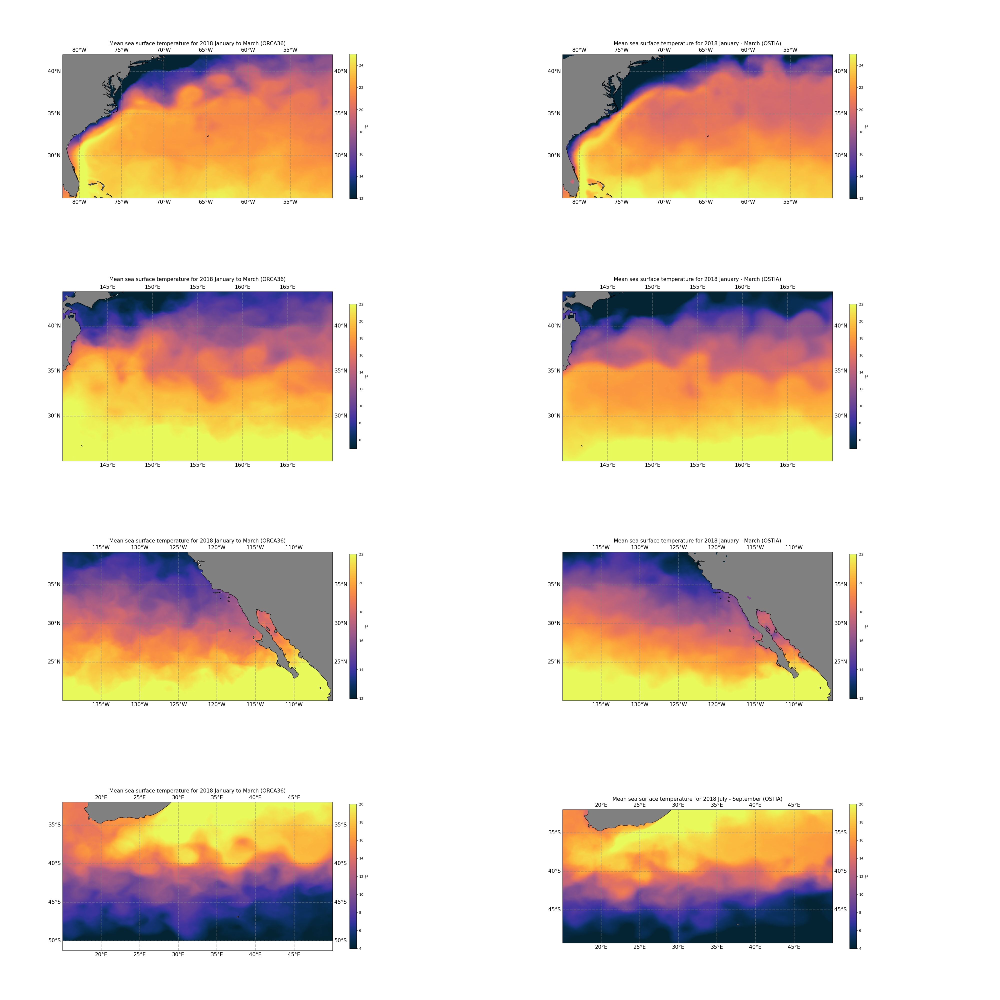
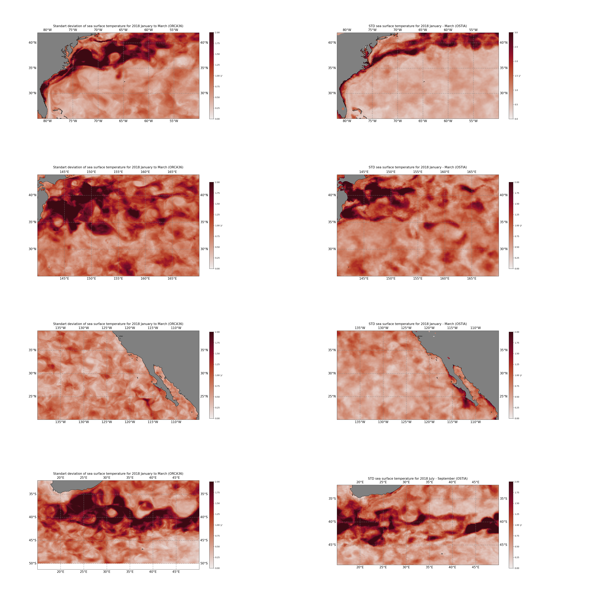

# ORCA36 validation project
## Introduction
The goal is to compare the sea surface temperature (SST) between ORCA36 simulation  (0.03° horizontal resolution and hourly output) and OSTIA satellite data (0.05° resolution and daily output). Due to the ORCA36 dimension, we focus on  key regions: Gulf Stream, Agulhas Current, Kuroshio Current, and California Current. We computed the daily means of hourly ORCA36 outputs and then we estimated the mean and standard deviation during the winter months of 2018 (winter being Jnauary to MArch for Northern regions and July to September for Southern Hemisphere). 

## Dataset
ORCA36 simulation provided by Clément Bricaud (MOI).
OSTIA SST product is available on the EDITO platform.

## Codebase
xarray, zarr, cartopy, matplotlib, numpy, copernicus_marine_client, cdsapi, cmocean

## Compute resources
1 - 4 CPU; 
4 Gi - 18 Gi

## Results

The comparison between ORCA36 and OSTIA can be seen below, first the mean :



and the standart deviation : 



All individual figures are in plots directory and the notebooks used to generate them are in notebooks directory

## People involved
Aurélie Albert & Marcela Contreras

## To-do list

 - [x] learn how to connect to a personnal git repository in the edito platform
 - [x] learn how to access ORCA36 data (concatenate the whole year of surface fields in one dataarray)
 - [x] learn how to access DUACS, OSTIA and GLOBCURRENT
 - [ ] compute annual mean and standart deviation for
   - [ ] SSH in ORCA36
   - [ ] SSH in AVISO
   - [x] SST in ORCA36
   - [x] SST in OSTIA
   - [ ] EKE from SSU SSV from ORCA36
   - [ ] EKE from SSU SSV from GLOBCURRENT
and save them in netcdf files
- [ ] make nice comparison plots !
- [x] Define regions
  - [x] Gulf Stream 
  - [x] Kuroshio 
  - [x] Aguilhas
  - [x] California 

```
domain=[[20,40,-140,-105],[25,43,-82,-50],[25,45,130,160],[-50,-30,15,50]] # [Lat0,Lat1,Lon0,Lon1]
region=("California Current","Gulf Stream","Kuroshio Current","Agulhas Current")
```
